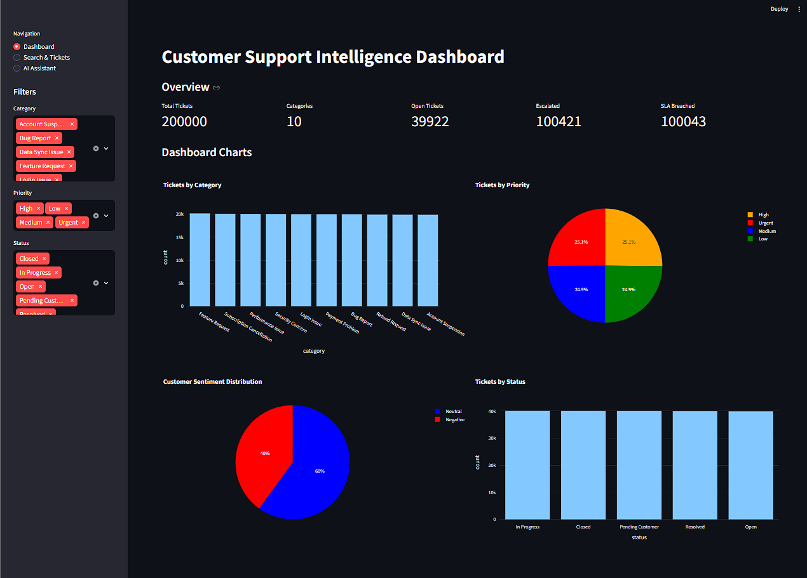
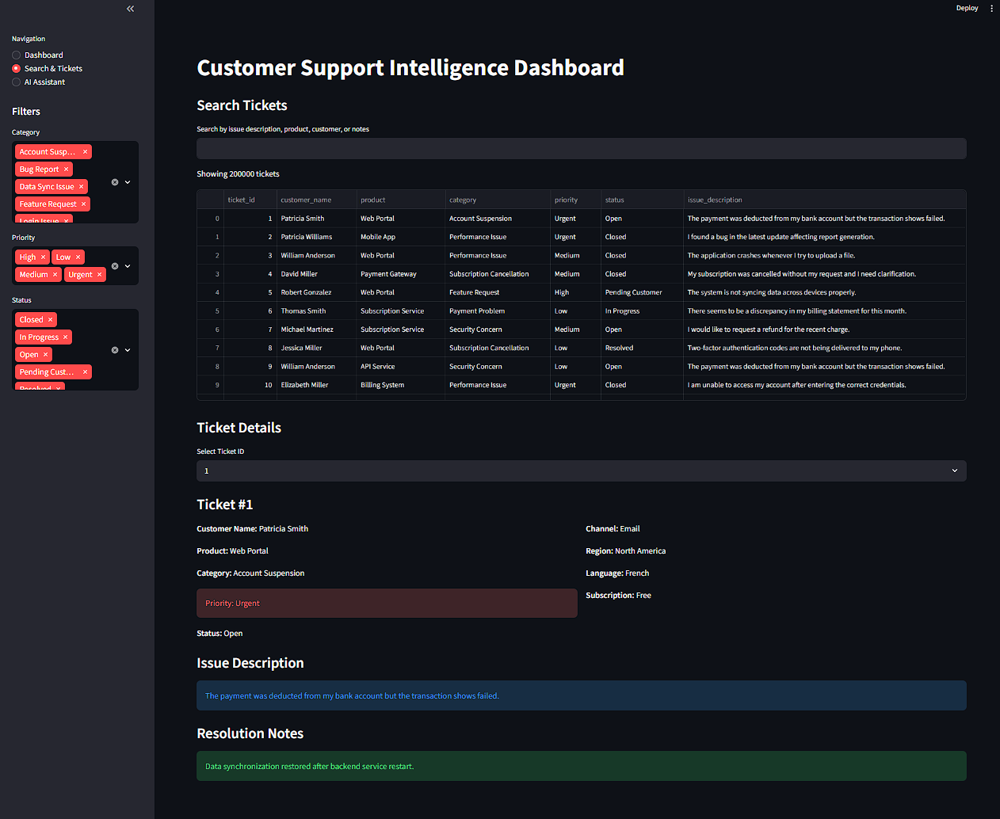
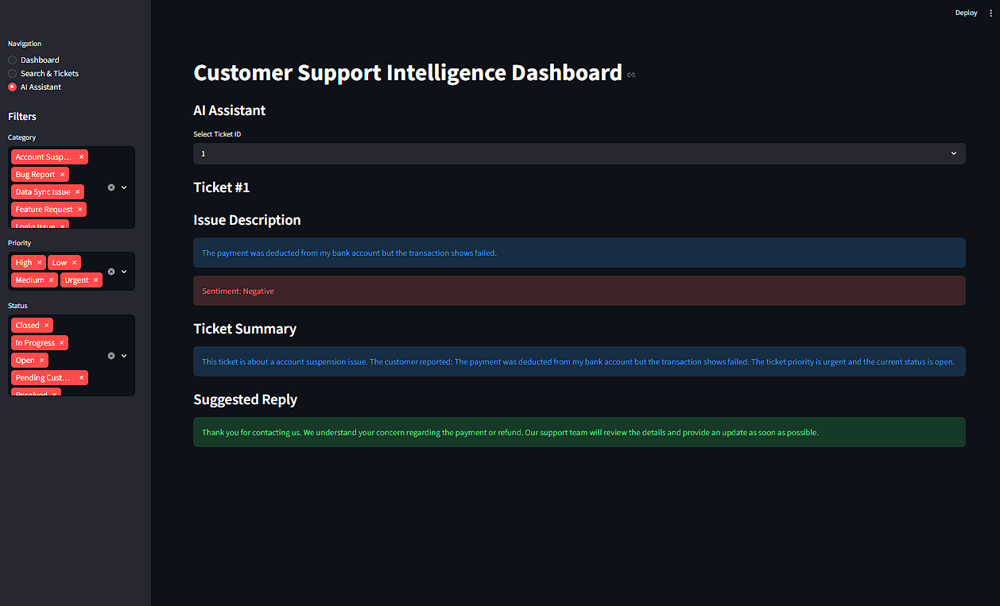

# Customer Support Intelligence Dashboard

A Python-based dashboard application for exploring, searching, and analyzing customer support tickets.

The project started as a simple customer support search tool and was later extended into an interactive dashboard with ticket filtering, analytics, visualizations, and basic AI-style assistance.

## Problem

Customer support teams often handle many tickets across different products, categories, priorities, and channels. It can be difficult to quickly understand common issues, find relevant tickets, and review important customer problems.

This project provides a simple dashboard to make support ticket data easier to search, inspect, and analyze.

## Features

- Interactive Streamlit dashboard
- Ticket search across support data
- Sidebar filters for category, priority, and status
- KPI overview for total tickets, open tickets, escalations, and SLA breaches
- Charts for ticket category, priority, status, and sentiment distribution
- Ticket detail view for inspecting individual support cases
- Basic AI-style ticket summary
- Suggested support reply generation
- Simple sentiment detection
- Unit tests for the original search/storage logic

## Screenshots

### Dashboard Overview


### Search & Tickets


### AI Assistant


## Tech Stack

- Python
- Streamlit
- Pandas
- Plotly
- JSON
- unittest

## Project Structure

```text
customer_support_search_assistant/
├── app/
│   ├── ai_assistant.py
│   ├── dashboard.py
│   └── data_loader.py
├── data/
│   └── tickets.csv
├── support_search/
│   ├── models.py
│   ├── sample_data.py
│   ├── search.py
│   └── store.py
├── tests/
│   └── test_store.py
├── main.py
└── README.md